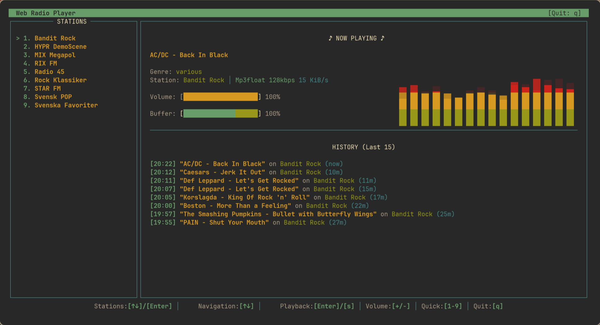

# WebRadio



A terminal-based internet radio player built with FFmpeg and ncurses. Stream live audio from internet radio stations with metadata display, FFT spectrum visualization, and optional MusicBrainz integration.
100% AI-Slop

## Features

- Stream internet radio stations using FFmpeg libraries
- Terminal UI with ncurses (color support)
- Real-time FFT spectrum analyzer visualization
- ICY metadata support (StreamTitle, artist/title)
- Optional MusicBrainz integration for enhanced track metadata
- Volume control with visual bar
- Song history tracking
- Keyboard-driven navigation

## Dependencies

### Required
- CMake 3.24+
- FFmpeg development libraries:
  - libavformat
  - libavcodec
  - libavutil
  - libswresample
- ncursesw

### Optional
- libcurl (for MusicBrainz metadata fetching)

## Building

### Basic Build

```bash
# Release build (optimized, no debug output)
cmake -B build -S . -DCMAKE_BUILD_TYPE=Release
cmake --build build

# Debug build (with status output)
cmake -B build -S . -DCMAKE_BUILD_TYPE=Debug
cmake --build build
```

### Build Options

| Option | Description |
|--------|-------------|
| `-DENABLE_MUSICBRAINZ=ON` | Enable MusicBrainz metadata lookup |
| `-DMETADATA_DEBUG_VIEW=ON` | Show raw metadata debug panel |

### Full-Featured Build Example

```bash
cmake -B build -S . -DCMAKE_BUILD_TYPE=Debug -DENABLE_MUSICBRAINZ=ON -DMETADATA_DEBUG_VIEW=ON
cmake --build build
```

### Clean Rebuild

```bash
rm -rf build && cmake -B build -S . -DCMAKE_BUILD_TYPE=Release && cmake --build build
```

## Usage

### Station File Format

Create a `stations.json` file:

```json
{
  "Jazz FM": "https://stream.example.com/jazz",
  "Classical": "https://stream.example.com/classical",
  "Rock Radio": "https://stream.example.com/rock"
}
```

### Running

```bash
# Run with interactive station selection
cd build && echo "1" | ./webradio

# Run with specific station file
cd build && ./webradio ../stations.json
```

## Controls

| Key | Action |
|-----|--------|
| `Up/Down` | Navigate stations |
| `Enter` | Play selected station |
| `Space` | Stop playback |
| `+/-` or `[/]` | Volume up/down |
| `q` | Quit |

## Project Structure

```
src/
  webradio.cpp       - Main application entry point
  tui.hpp/cpp        - Terminal UI (ncurses)
  fft_spectrum.hpp/cpp - FFT audio visualization
  byte_ringbuffer.hpp  - Lock-free ring buffer
  metadata_fetcher.hpp/cpp - MusicBrainz integration
  miniaudio.h        - Audio output library
```

## License

MIT License
