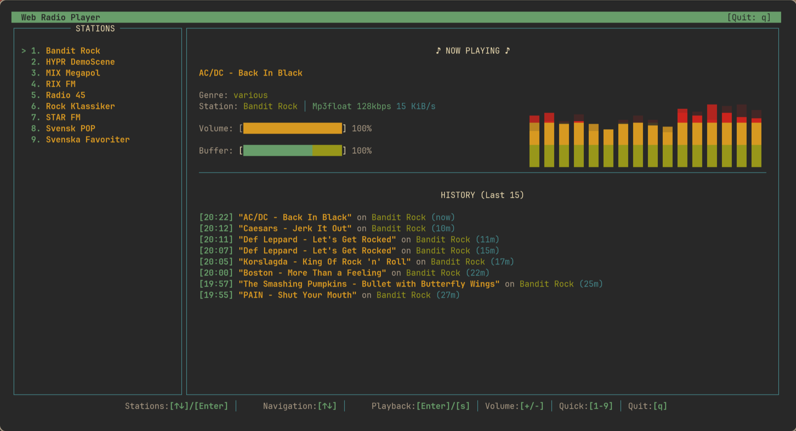

# WebRadio



A terminal-based internet radio player built with FFmpeg and ncurses. Stream live audio from internet radio stations with metadata display, FFT spectrum visualization, and optional MusicBrainz integration.
100% AI-Slop

## Features

- Stream internet radio stations using FFmpeg libraries
- Terminal UI with ncurses (color support)
- Real-time FFT spectrum analyzer visualization
- ICY metadata support (StreamTitle, artist/title)
- Optional MusicBrainz integration for enhanced track metadata
- Volume control with visual bar
- Song history tracking
- Keyboard-driven navigation

## Dependencies

### Required
- CMake 3.24+
- FFmpeg development libraries:
  - libavformat
  - libavcodec
  - libavutil
  - libswresample
- ncursesw

## Building

### Basic Build

```bash
# Release build (optimized, no debug output)
cmake -B build -S . -DCMAKE_BUILD_TYPE=Release -DCMAKE_INSTALL_PREFIX="$HOME/.local"
cmake --build build/release
# Or to install in {PREFIX}/bin
cmake --build build/release --target install

# Debug build (with status output)
cmake -B build -S . -DCMAKE_BUILD_TYPE=Debug
cmake --build build/debug
```


### Clean Rebuild

```bash
rm -rf build && cmake -B build -S . -DCMAKE_BUILD_TYPE=Release && cmake --build build
```

## Usage

### Station File Format

Create a `stations.json` file:

```json
{
  "Jazz FM": "https://stream.example.com/jazz",
  "Classical": "https://stream.example.com/classical",
  "Rock Radio": "https://stream.example.com/rock"
}
```

### Running

```bash
# Run with interactive station selection
cd build && echo "1" | ./webradio

# Run with specific station file
cd build && ./webradio ../stations.json
```

### Station File Search Priority

When no station file argument is provided, WebRadio searches for `stations.json` in this order:

1. Current working directory (`./stations.json`)
2. Same directory as the `webradio` executable
3. User config directory:
   - `$XDG_CONFIG_HOME/webradio/stations.json` (if `XDG_CONFIG_HOME` is set)
   - otherwise `~/.config/webradio/stations.json`

If a station file path is passed as an argument, that path is used directly:

```bash
./webradio /path/to/stations.json
```

## Controls

| Key | Action |
|-----|--------|
| `Up/Down` | Navigate stations |
| `Enter` | Play selected station |
| `Space` | Stop playback |
| `+/-` or `[/]` | Volume up/down |
| `q` | Quit |


## License

MIT License
